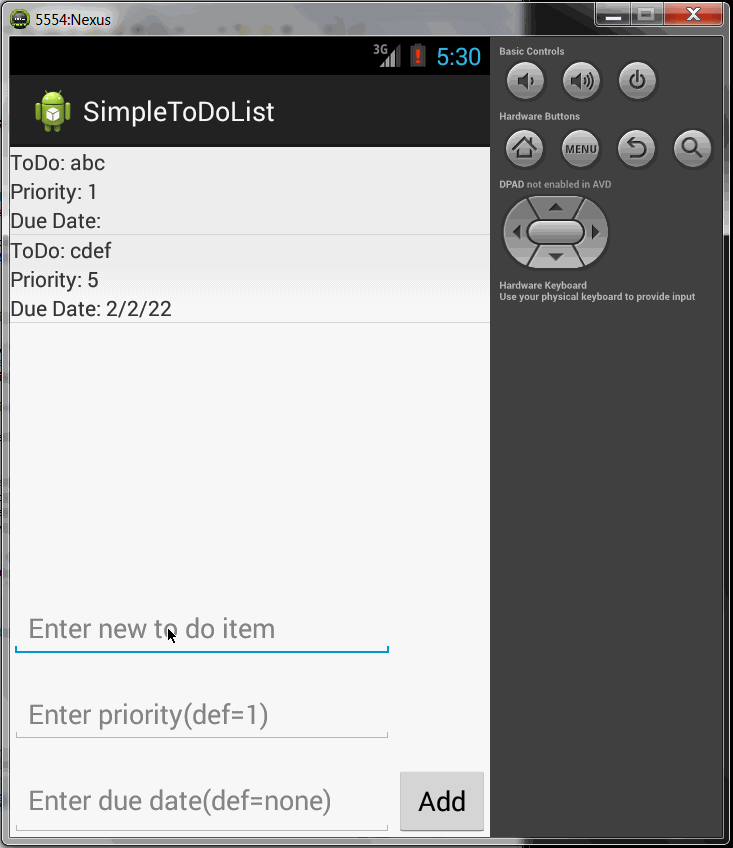

simple-to-do-list
=================

This android application is for maintaining a simple to-do list. The basic allowed operations are addition, deletion and editing of entries in the to-do list.

Time spent:  36 hours spent in total

Completed user stories:

 Required: User can view a list of to-do items
 Required: User can add a to-do item to the list.
 Required: User can delete a to-do item from the list using a long-click
 Required: User can edit a to-do item from the list using a single click.
 Required: The to-do list is saved in a file on any change to the list.
 Optional: Persist the todo items into SQLite instead of a text file -> For all add, edit and delete operations the entire db table is cleared and re-written.
 Optional: Add support for completion due dates for todo items (and display in listview item) -> only as a date field
 Optional: Style the todo items in the list using a custom adapter -> basic support to display 3 fields name, priority and due date together for one entry.
 Optional: Add support for selecting a priority for todo items (and display in listview item) -> only as a text integer field.
 
Notes:

Walkthrough of all user stories:

GIF created with LiceCap.
